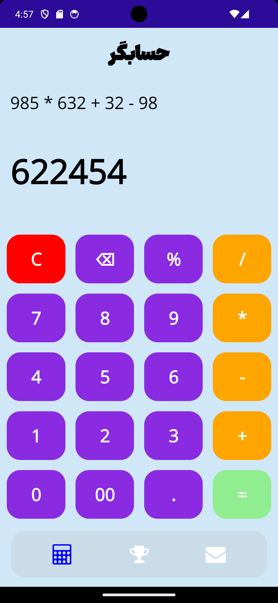

 

 
 <table  style="border-collapse: collapse; border: none;">
  <tr>
    <td style="padding: 10px;border: none"> </td>
    <td style="padding: 10px;border: none"> 
</td>
  </tr>
  <tr>
    <td style="padding: 10px;border: none"> </td>
    <td style="padding: 10px;border: none"> </td>
 
  </tr>
</table>
 

## Getting Started

calculator app made with maui framework 

 

 
 